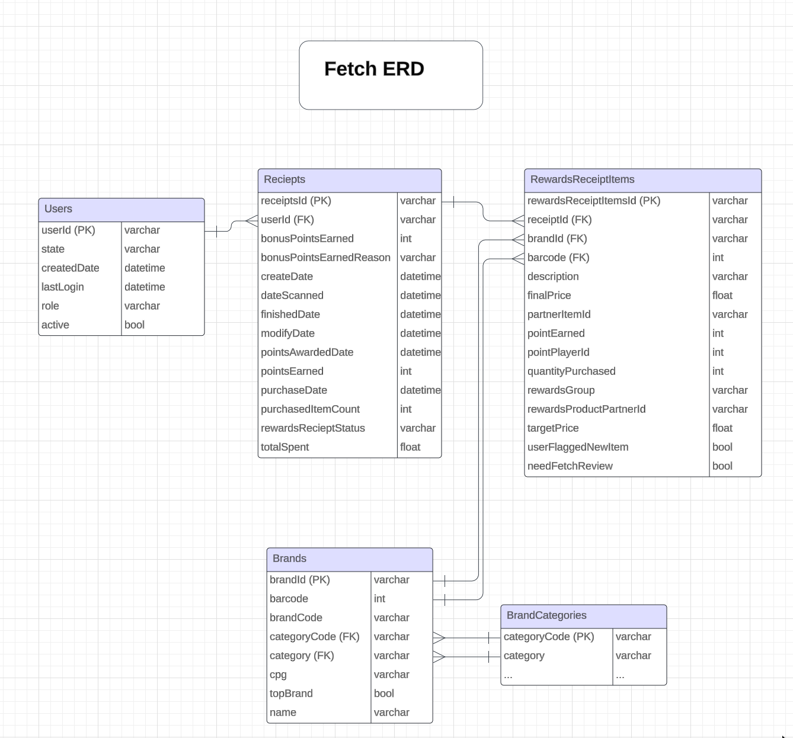

To follow the submission:

1. The model can be seen below for a reasonable way to format our data

2. In Clean_and_format_data we do a lot of work. we 
    Investigate and fix data quality issues, unify columns, and determine if we can live with nulls

    We then format data as close to the diagram above as possible.  This will allow us to complete part 2 in creating sql queries. 

3. in Stakeholder_queries, we answer questions 1-3 (will do more time permitting) using the data provided by step 2 above. 

4. we can now answer stakeholder questions below: 

What questions do you have about the data?

    We have both a brand category and category code.  What can the code be used for and if this is something we need to access often, would it be worth
    splitting this into its own column (as seen in diagram) with supplemental information about brand categories.  In addition what do the codes represent?
    I noticed that RewardsReceiptItem columns had up to 35 distinct values, are these all needed and can we possibly save space by eliminating some of these? 
    What is the purpose behind $oid? Is this from an old database migration and how can we organize data better in the future.
    What is the purpose of targetPrice? 
    Why is each brand associated with a single barcode?  I could see a situation in the future where we would want a 1 to many between barcodes and brands.
    Unless by brand we actually mean this to be a product?  Either way we may want to consider a product table in the future with associated barcodes. 
    Data is skewed around the prices and quantity purchased, but I think this is natural that there are more low costing items and more people who buy fewer items.

Data Quality issues
    The biggest issue is it may be hard to gain much usefulness out of this data due to nulls.  Many columns where we could be getting important information from 
    (barcode, brand code) since most of the analysis comes from the receipts dataset it may be pertinent to address that data first
    cpg is a very maligned column with data in various different formats.  It would be useful to perform unification here.
    date columns are not well expressed and may do better in a more readable format for filtering.
    Do we need multiple users with the same ID?  If making this a unique primary key, we will run into issues.

What do I need to know to resolve issues? 

    Do we have a merge stragegy behind duplicate user ids? 
    What is the basis for the issues with cpg and how can we align them?
    How are barcodes assigned?  can we fill in this data somehow?  Does each brand have a brand code?

What other information would you need to help you optimize the data assets you're trying to create?

    What is the primary use case of this data and what is the expected volume? How many reads per day? How many writes?
    Is this expected to grow?  After that it would be important to understand what we plan to get out of this data.
    Are there reports we need generated based on this data? are there systems relying on this data? 
    All of these questions are good to ask in order to understand where we should assign things such as keys and what 
    resources the database will need.

What performance and scaling concerns do you anticipate in production and how do you plan to address them?

    User duplication is a large concern and the suggested fix would be to have a migration stragegy. Potentially we 
    only keep the most recent instance of a user and update any foreign keys. 
    I am concerned about nulls and bad data bloating the database - this could be resolved by enforcing certain values. 
    What is the use case of this data? can we archive old data if it is no longer usesd? (maybe 6 months) - the key to understanding scaling issues will be getting these requirements
    If the queries asked above are the primary use case, we can ensure we have proper indexing on columns like receiptId, datescanned, brandcode, userId, and receiptstatus
    If we need many reads/writes could load testing help ensure confidence while scaling?
    If we are primarily running analytical queries, could a data warehouse make more sense for our data?